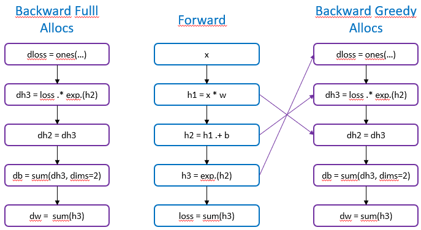

# AD Tests


## Tape based ecosystem

Survey of potential options to center traditionnal ML around.


| |Tracker|ReversedDiff|Yota|Nabla|Autograd|
|:---:|:---:|:---:|:---:|:---:|:---:|
|Principle|Tape base|Tape base|Tape base|Tape base|Tape base|
|GPU support|Y|?|Y|Y|Y|
|Second/higher order|?|Y|N|N|Y|
|ForwardDiff|N|Y|N|N|N|
|ChainRules support|N|Y|Y|Y|N|
|Maintenance|inactive|limited - 2-3 persons|active - 1 person|limited - 2 persons|inactive - 1 person|
|Pre-allocation support| |Y| | | |
|Performance (1-5)|2|4|4| |4|
|Robust stateful accumulation (RNN)| | | | | |
|Upsides| | | | | |
|Downsides| | | | | |


## Dense layer with exp activation

### Zygote.jl

`/experiments/zygote/dense.jl`

```julia
#  47.057 ms (28 allocations: 105.00 MiB)
@btime zygote_test($m, $x);
```

## Tracker.jl

`/experiments/tracker/dense.jl`

```julia
#  66.045 ms (140 allocations: 107.02 MiB)
@btime tracker_test($m, $x);
```

## Yota.jl

`/experiments/yota/dense.jl`

```julia
# 43.431 ms (77 allocations: 89.01 MiB)
@btime val, grads = yota_test($yota_loss, $m, $x);
```

### AutoGrad.jl

`/experiments/autograd/dense.jl`

```julia
#  37.210 ms (154 allocations: 81.01 MiB)
@btime autograd_test($x, $w1, $b1);
```

### ReverseDiff.jl

`/experiments/reversediff/dense.jl`

```julia
# 47.326 ms (0 allocations: 0 bytes)
@btime gradient!($results, $compiled_f_tape, $inputs);
# 61.471 ms (113 allocations: 139.01 MiB)
@btime gradient!($results, $rd_loss, $inputs);
# 60.507 ms (119 allocations: 148.02 MiB)
@btime gradient($rd_loss, $inputs);
```

## Nabla.jl

Stack overflow crash on rand().

## Diffractor.jl

Requires Julia v1.10

## Manual forward-backward

`/experiments/manual/dense.jl`

```julia
# 42.532 ms (34 allocations: 81.00 MiB)
@btime grads_a = g_custom_A($x, $ps);
# 38.850 ms (29 allocations: 49.00 MiB)
@btime grads_b = g_custom_B($x, $ps);
# 26.699 ms (19 allocations: 17.00 MiB)
@btime grads_c = g_custom_C($x, $ps);
```

How realistic is it to achieve cutom backward pass optimisations? 
For example, reusing forward pass allocations.


